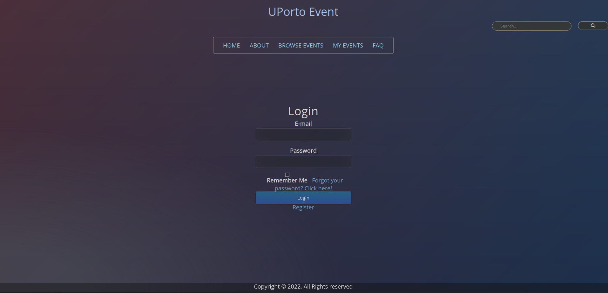

# lbaw22122

## Project

UPorto is an Event Management web application developed for the **Database and Web Applications Laboratory** class using the Laravel framework.

Final release: https://lbaw22122.lbaw.fe.up.pt.

#### 2.2. User Credentials

| Type          | Email  | Password |
| ------------- | --------- | -------- |
| Administrator | admin@example.com    |  1234 |
| Authenticated User | user@example.com    |   1234 |
| Event Moderator   | moderator@example.com    | 1234 |

## Docker Commands

Commands to run the project on localhost (linux):

~~~~
#run the composer
docker-compose up

# update database
php artisan db:seed

# in another terminal
php artisan serve

# If any error occur, try the following:

# download composer if not installed 
composer install
# or
composer update

# update service
sudo service postgresql stop
sudo update-rc.d postgresql disable

# common error fix: kill the docker image if it is already running
docker ps
docker kill id

# clear cache
php artisan cache:clear

# web app https://localhost:8000 
# pgadmin database http://localhost:4321/
~~~~

### Some relevant notes
#### VScode - Clear Cache
~~~~
Open the Command Palette (Ctrl+Shift+P)
Developer: Reload Window
~~~~

#### Laravel Notification
~~~~
How can I change the design of notification?

First you need to publish the notification package’s resources 
php artisan vendor:publish --tag=laravel-notifications
php artisan vendor:publish --tag=laravel-mail

The colors and style are controlled by the CSS file in resources/views/vendor/mail/html/themes/default.css
~~~~

### Components

* [EAP: Architecture Specification and Prototype](Docs/EAP/EAP.md)
* [EBD: Database Specification Component](Docs/EBD/EBD.md)
* [ER: Requirements Specification Component](Docs/ER/er.md)
* [PA: Product and Presentation](Docs/PA/pa.md)

***

### Screenshots

### Team

GROUP22122, 03/01/2023

* João Sousa, up201904739@up.pt    
* Mikhail Ermolaev, up202203498@up.pt
* David Burchakov, up202203777@up.pt
* Válter Castro, up201706546@up.pt
